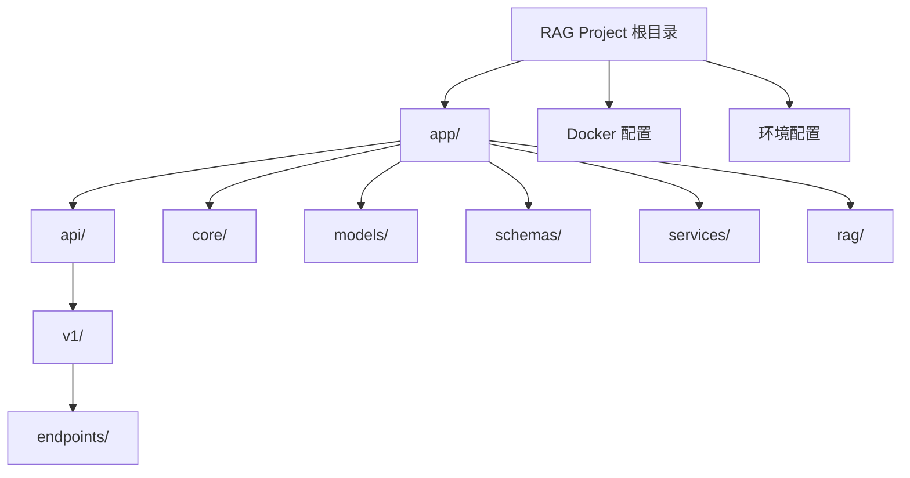

# RAG Knowledge System - 项目架构文档

## 变更记录 (Changelog)

### 2025-12-18 15:00:06
- 初始化项目架构文档
- 完成全仓清点，识别了 25 个 Python 源文件
- 分析了 FastAPI + LlamaIndex + MySQL + Milvus 技术栈
- 建立模块级文档结构

---

## 项目愿景

RAG Knowledge System 是一个基于检索增强生成（Retrieval-Augmented Generation）的知识管理系统。项目使用 FastAPI 构建后端 API，集成 LlamaIndex 框架实现向量化文档检索，利用 Milvus 存储文档向量，MySQL 管理元数据，并通过 OpenAI API 提供智能对话能力。

**核心价值**：
- 智能文档上传与解析（支持 PDF、DOCX 等格式）
- 基于语义的文档检索和问答
- 文档元数据管理与查看
- 支持 Docker 一键部署的完整技术栈

---

## 架构总览

### 技术栈
- **Web 框架**: FastAPI + Uvicorn
- **数据验证**: Pydantic v2.5+
- **关系数据库**: MySQL 8.0（元数据存储）
- **向量数据库**: Milvus v2.3.13（文档向量存储）
- **RAG 引擎**: LlamaIndex v0.10+
- **Embedding**: OpenAI Embeddings
- **LLM**: OpenAI GPT
- **ORM**: SQLAlchemy 2.0+
- **容器化**: Docker + Docker Compose

### 架构分层
```
┌─────────────────────────────────────┐
│    FastAPI REST API Layer           │  ← 对外接口层
├─────────────────────────────────────┤
│    Services Layer                   │  ← 业务逻辑层
│  - RAG Service (LlamaIndex)         │
│  - Viewer Service                   │
├─────────────────────────────────────┤
│    Models & Schemas Layer           │  ← 数据模型层
│  - SQLAlchemy Models                │
│  - Pydantic Schemas                 │
├─────────────────────────────────────┤
│    Data Storage Layer               │  ← 数据存储层
│  - MySQL (元数据)                   │
│  - Milvus (向量)                    │
└─────────────────────────────────────┘
```

---

## 模块结构图



---

## 模块索引

| 模块路径 | 职责 | 关键文件 | 状态 |
|---------|------|---------|------|
| `/app` | 应用主模块，包含所有业务代码 | `main.py` | 活跃 |
| `/app/api` | API 接口定义层 | `deps.py`, `v1/router.py` | 活跃 |
| `/app/api/v1/endpoints` | 具体的 API 端点实现 | `chat.py`, `viewer.py` | 开发中 |
| `/app/core` | 核心配置与数据库连接 | `config.py`, `database.py` | 完成 |
| `/app/models` | SQLAlchemy 数据模型 | `document.py`, `chunk.py` | 待实现 |
| `/app/schemas` | Pydantic 数据验证模型 | `document_schema.py`, `chat_schema.py` | 待实现 |
| `/app/services` | 业务逻辑层 | `rag_service.py`, `viewer_service.py` | 待实现 |
| `/app/rag` | RAG 核心逻辑 | `retrievers.py` | 待实现 |

---

## 运行与开发

### 本地开发环境启动

1. **安装依赖**
```bash
pip install -r requirements.txt
```

2. **配置环境变量**
复制并编辑 `.env` 文件：
```bash
# 配置数据库连接
DB_SERVER=localhost
DB_PORT=3306
DB_USER=rag_user
DB_PASSWORD=rag_password
DB_NAME=rag_data

# 配置 Milvus
MILVUS_HOST=localhost
MILVUS_PORT=19530

# 配置 OpenAI API
OPENAI_API_KEY=sk-your-api-key
```

3. **启动服务**
```bash
uvicorn app.main:app --reload --host 0.0.0.0 --port 8000
```

4. **访问 API 文档**
- Swagger UI: http://localhost:8000/docs
- ReDoc: http://localhost:8000/redoc

### Docker 部署（推荐）

使用 Docker Compose 一键启动所有服务：

```bash
docker-compose up -d
```

这将启动：
- FastAPI 后端（端口 8000）
- MySQL 数据库（端口 3306）
- Milvus 向量库（端口 19530）
- Etcd（Milvus 依赖）
- MinIO（Milvus 对象存储）

### 环境测试

运行测试脚本验证环境配置：
```bash
python test_env.py
```

---

## 测试策略

### 当前状态
- **单元测试**: 未实现
- **集成测试**: 未实现
- **环境测试**: 已实现（`test_env.py`）

### 测试覆盖缺口
1. 缺少针对 API 端点的单元测试
2. 缺少数据库模型的测试
3. 缺少 RAG 服务的集成测试
4. 缺少 Pydantic Schema 验证测试

### 建议的测试框架
- `pytest`: 测试框架
- `pytest-asyncio`: 异步测试支持
- `httpx`: FastAPI 测试客户端
- `pytest-cov`: 代码覆盖率报告

---

## 编码规范

### Python 代码风格
- 遵循 PEP 8 规范
- 使用类型注解（Type Hints）
- 文档字符串采用 Google 风格

### 项目结构约定
- **Models**: SQLAlchemy ORM 模型，定义数据库表结构
- **Schemas**: Pydantic 模型，用于请求/响应验证
- **Services**: 业务逻辑层，封装复杂操作
- **Endpoints**: API 路由，仅处理请求/响应，不包含业务逻辑

### 命名约定
- 文件名: `snake_case.py`
- 类名: `PascalCase`
- 函数/变量: `snake_case`
- 常量: `UPPER_SNAKE_CASE`

### 依赖注入
使用 FastAPI 的 `Depends` 进行依赖注入，例如数据库会话：
```python
from fastapi import Depends
from sqlalchemy.orm import Session
from app.api import deps

@router.get("/items")
def get_items(db: Session = Depends(deps.get_db)):
    # 使用 db 进行数据库操作
    pass
```

---

## AI 使用指引

### 适合 AI 辅助的任务
1. **API 端点开发**: 实现 `/app/api/v1/endpoints/` 中的路由处理函数
2. **数据模型补全**: 完善 `/app/models/` 和 `/app/schemas/` 中的模型定义
3. **服务层实现**: 编写 `/app/services/` 中的业务逻辑
4. **测试用例编写**: 为现有代码添加单元测试和集成测试
5. **文档生成**: 为函数和类生成文档字符串

### 上下文提供建议
当请求 AI 帮助时，提供以下上下文：
- 相关的 Model 和 Schema 定义
- 数据库表结构（如已定义）
- API 端点的预期输入/输出格式
- 业务逻辑需求描述

### 代码审查要点
- 确保异步函数使用 `async/await`
- 验证数据库连接正确关闭（使用 `Depends(get_db)`）
- 检查环境变量是否正确加载
- 确认向量维度与 OpenAI Embedding 一致（1536 维）

---

## 数据流示例

### 文档上传与索引流程
```
用户上传文档
    ↓
FastAPI 接收文件
    ↓
文档解析 (LlamaIndex Readers)
    ↓
文本分块 (Chunking)
    ↓
调用 OpenAI Embedding API
    ↓
存储向量到 Milvus
    ↓
存储元数据到 MySQL
    ↓
返回文档 ID
```

### 智能问答流程
```
用户提问
    ↓
问题向量化 (OpenAI Embedding)
    ↓
Milvus 相似度检索
    ↓
获取 Top-K 相关文档块
    ↓
构建 Prompt (问题 + 上下文)
    ↓
调用 OpenAI LLM
    ↓
返回答案
```

---

## 环境变量说明

| 变量名 | 用途 | 示例值 | 必需 |
|--------|------|--------|------|
| `DB_SERVER` | MySQL 服务器地址 | `localhost` / `mysql_db` | 是 |
| `DB_PORT` | MySQL 端口 | `3306` | 是 |
| `DB_USER` | MySQL 用户名 | `rag_user` | 是 |
| `DB_PASSWORD` | MySQL 密码 | `rag_password` | 是 |
| `DB_NAME` | 数据库名 | `rag_data` | 是 |
| `MILVUS_HOST` | Milvus 服务器地址 | `localhost` / `milvus-standalone` | 是 |
| `MILVUS_PORT` | Milvus 端口 | `19530` | 是 |
| `OPENAI_API_KEY` | OpenAI API 密钥 | `sk-xxxxx` | 是 |

**注意**:
- 在本地开发时，使用 `localhost`
- 在 Docker 内部时，使用服务名（如 `mysql_db`, `milvus-standalone`）

---

## 常见问题 (FAQ)

### Q1: 如何切换不同的 Embedding 模型？
A: 修改 LlamaIndex 的 Embedding 配置，并确保 Milvus 的向量维度匹配。

### Q2: 数据库连接失败怎么办？
A: 检查 `.env` 文件中的配置，确保 MySQL 服务已启动，并验证连接参数。

### Q3: Milvus 连接超时？
A: 确保 Milvus 服务已完全启动（可能需要 30-60 秒），检查端口 19530 是否可访问。

### Q4: OpenAI API 调用失败？
A: 验证 `OPENAI_API_KEY` 是否正确，检查网络连接和 API 配额。

---

## 相关资源

- [FastAPI 官方文档](https://fastapi.tiangolo.com/)
- [LlamaIndex 官方文档](https://docs.llamaindex.ai/)
- [Milvus 官方文档](https://milvus.io/docs)
- [SQLAlchemy 2.0 文档](https://docs.sqlalchemy.org/)
- [Pydantic V2 文档](https://docs.pydantic.dev/)

---

## 下一步开发计划

### 高优先级
1. 完善 `/app/models/` 中的数据库模型定义（Document、Chunk）
2. 实现 `/app/schemas/` 中的 Pydantic 验证模型
3. 开发 `/app/services/rag_service.py` 核心 RAG 逻辑
4. 实现文档上传和对话 API 端点

### 中优先级
1. 添加用户认证与权限管理
2. 实现文档管理 API（列表、删除、更新）
3. 添加日志记录和错误监控
4. 编写单元测试和集成测试

### 低优先级
1. 性能优化（缓存、异步处理）
2. 添加前端界面
3. 支持更多文档格式
4. 实现多语言支持
