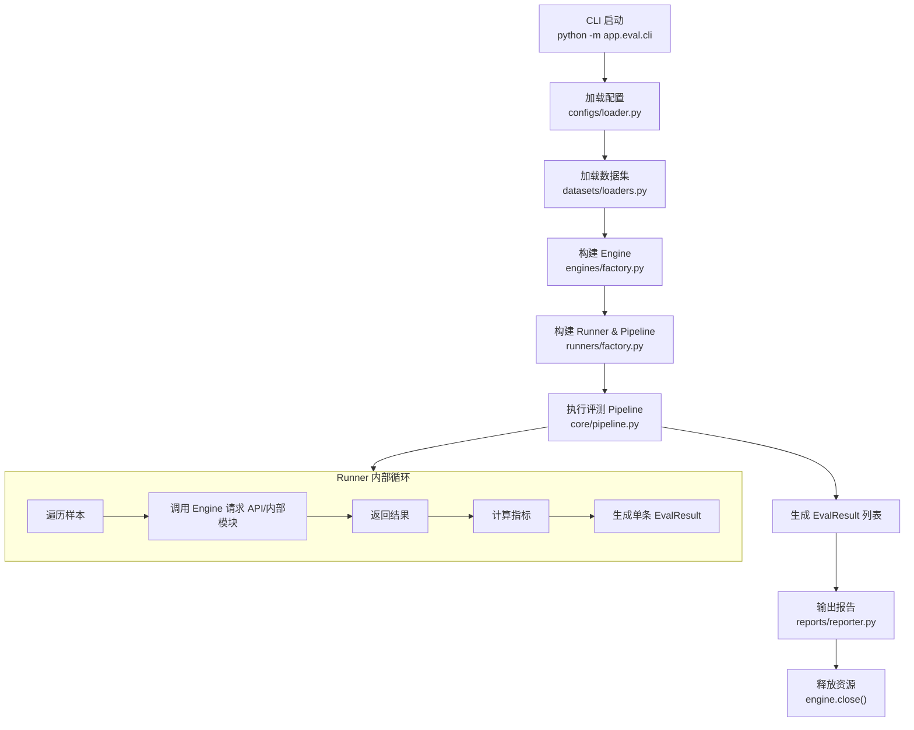

# Eval 模块说明

本说明覆盖：功能、配置、使用流程与常见问题。适用于当前 `app/eval` 目录的实现版本。

---

## 1. 模块功能概览

Eval 模块目标：在不依赖具体业务实现的前提下，提供统一、可扩展的评测框架，支持 Retrieval / Rerank / Rewrite / Generation / E2E 多阶段评测，并可接入 ragas 第三方评测。

已实现能力：

- **统一接口层**：Engine / Runner / Metric / Reporter 标准化
- **多数据格式支持**：JSONL / CSV 统一加载，支持字段映射、抽样、去重、split 过滤
- **多评测引擎**：API / internal / ragas（ragas 已接入 evaluate）
- **评测指标体系**：检索、重排、改写、生成、E2E 指标与 builder
- **报告输出**：JSON / CSV / Markdown，支持分组统计与分位数
- **统一 CLI**：读取配置 → 加载数据 → 构建引擎/runner → 执行评测 → 输出报告
- **资源释放**：主流程统一调用 `engine.close()`（例如 ApiEngine 的 httpx 连接）

---

## 2. 目录结构

```
app/eval/
  README.md               # 本文档
  EVAL_PLAN.md            # 规划说明
  cli.py                  # 统一评测入口
  configs/
    eval_config.yaml      # 默认配置
    loader.py             # YAML/JSON 配置加载器
  core/
    interfaces.py         # 核心接口与数据结构
    registry.py           # 注册表
    pipeline.py           # 评测流水线
  datasets/
    loaders.py            # JSONL/CSV 加载器
    validators.py         # 校验与规范化
    schema.py             # 字段定义
  engines/
    api_engine.py         # HTTP API 引擎
    internal_engine.py    # 内部调用引擎
    ragas_engine.py       # ragas 引擎（evaluate）
    factory.py            # engine 工厂
  judges/
    embedding_judge.py    # embedding 判分器（语义相似）
    llm_judge.py          # LLM 判分器（生成/E2E）
  metrics/
    retrieval.py          # 检索指标
    rerank.py             # 重排指标
    rewrite.py            # 改写指标
    generation.py         # 生成指标
    e2e.py                # 端到端指标
    utils.py              # 指标通用工具
  reports/
    reporter.py           # 报告输出实现
    factory.py            # reporter 工厂
  runners/
    retrieval_runner.py
    rerank_runner.py
    rewrite_runner.py
    generation_runner.py
    e2e_runner.py
    ragas_runner.py
    factory.py            # runner + pipeline 工厂
```

---

## 3. 配置说明（eval_config.yaml）

> 配置完全可按需裁剪；未提供的字段由代码侧默认值兜底。

### 3.1 全局 & 数据

```yaml
project:
  name: "rag_eval"
  run_name: "dev"
  run_id: "dev"
  output_dir: "app/eval/outputs"
  tags: []
  seed: 42
  save_config_snapshot: true
  description: ""

data:
  format: "jsonl"                # jsonl | csv
  path: "app/eval/data/sample.jsonl"
  encoding: "utf-8"
  split: null                    # train/dev/test
  sample_limit: null
  shuffle: false
  shuffle_seed: 42
  filters: {}
  validate: true
  on_validation_error: "fail"    # fail | skip
  drop_empty_query: true
  deduplicate: false
  dedup_key: "id"
  field_map:
    id: "id"
    query: "query"
    answers: "answers"
    relevant_doc_ids: "relevant_doc_ids"
    relevant_texts: "relevant_texts"
    rewrite: "rewrite"
    metadata: "metadata"
    candidate_doc_ids: "candidate_doc_ids"
    candidate_texts: "candidate_texts"
    contexts: "contexts"
    split: "split"
```

### 3.2 引擎配置

```yaml
engine:
  type: "api"               # api | internal | ragas

api:
  base_url: "http://localhost:8010"
  timeout_seconds: 30
  max_concurrency: 10
  retries: 2
  retry_backoff_seconds: 0.2
  retry_on_status: [429, 500, 502, 503, 504]
  verify_ssl: true
  circuit_breaker:
    enabled: false
    failure_threshold: 5
    reset_seconds: 30
  endpoints:
    retrieve: "/api/v1/search/multi-recall"
    rerank: ""
    rewrite: ""
    generate: ""
  headers:
    # Authorization: "Bearer xxx"

internal:
  search_gateway_path: ""
  lazy_init: true

ragas:
  enabled: false
  llm_provider: ""
  embedding_provider: ""
  metrics: []
  batch_size: 8
```

### 3.3 判分器配置（rewrite/generation/e2e）

```yaml
judges:
  embedding:
    enabled: false
    model_name: "sentence-transformers/all-MiniLM-L6-v2"
    normalize: true
  llm:
    enabled: false
    provider: "openai"
    api_key: ""
    base_url: ""
    model: "gpt-4o-mini"
    temperature: 0.0
    max_tokens: 512
    timeout_seconds: 30
```

### 3.4 Runner 配置（按阶段）

```yaml
runners:
  retrieval:
    enabled: true
    top_n: 10
    recall_top_k: 100
    metrics: ["recall@k", "mrr", "ndcg@k", "hit@k"]
    k_values: [1, 3, 5, 10]
    save_raw_payload: false
  rerank:
    enabled: false
    top_n: 5
    recall_top_k: 100
    metrics: ["ndcg@k", "precision@k", "boost_ratio", "hit@1"]
    k_values: [1, 3, 5, 10]
    candidate_source: "retrieval"   # retrieval | dataset
    baseline_source: "retrieval"    # retrieval | fixed
  rewrite:
    enabled: false
    rewrite_source: "field"         # field | engine
    metrics: ["semantic_preservation", "retrieval_gain", "zero_result_reduction"]
    compare_with_original: true
    semantic_similarity: "auto"     # auto | embedding | jaccard
    gain_metric: "ndcg@10"
  generation:
    enabled: false
    metrics: ["faithfulness", "answer_relevance", "answer_correctness", "hallucination_rate"]
    context_source: "retrieval"     # retrieval | field
    max_contexts: 5
    llm_judge:
      enabled: false
      model: ""
      temperature: 0.0
      prompt_version: "v1"
      max_tokens: 512
      retry_on_fail: true
  e2e:
    enabled: false
    metrics: ["e2e_correctness", "e2e_faithfulness", "latency", "ttft", "cost_per_query"]
    record_latency: true
    cost:
      enabled: false
      currency: "USD"
      prompt_cost_per_1k: 0.0
      completion_cost_per_1k: 0.0
  ragas:
    enabled: false
    metrics: ["faithfulness", "answer_relevancy", "context_precision", "context_recall"]
```

### 3.5 报告与日志

```yaml
report:
  formats: ["json", "csv", "md"]
  save_samples: true
  save_errors: true
  save_raw_payload: false
  include_metadata: true
  aggregate_by: ["metadata.domain"]
  percentiles: [50, 90, 95]
  sample_output_file: "samples.jsonl"
  summary_output_file: "summary.json"
  markdown_output_file: "report.md"
```

---

## 4. 使用说明

### 4.1 直接运行（CLI）

```bash
python -m app.eval.cli --config app/eval/configs/eval_config.yaml
```

覆盖输出目录：

```bash
python -m app.eval.cli --config app/eval/configs/eval_config.yaml --output-dir app/eval/outputs/dev_run
```

### 4.2 Python 代码调用

```python
from app.eval.configs.loader import load_config
from app.eval.datasets import load_samples
from app.eval.engines import build_engine
from app.eval.runners.factory import build_pipeline
from app.eval.reports import build_reporter
from app.eval.core.interfaces import EvalContext

config = load_config("app/eval/configs/eval_config.yaml")
samples = load_samples(path="app/eval/data/sample.jsonl", format="jsonl")
engine = build_engine(config)
pipeline = build_pipeline(config, engine)
reporter = build_reporter(config)

context = EvalContext(run_id="dev", engine_type="api")
results = await pipeline.run(samples, context)
reporter.write(results, "app/eval/outputs")
await engine.close()
```

---

## 5. 数据格式示例

JSONL：
```
{"id":"q1","query":"xxx","answers":["..."],"relevant_doc_ids":["1","2"],"relevant_texts":["..."],"rewrite":"...","metadata":{"domain":"finance"}}
```

CSV：
```
id,query,answers,relevant_doc_ids,relevant_texts,rewrite,metadata
```

CSV 的 list 字段必须是 JSON 字符串，例如：`["a","b"]`。

---

## 6. ragas 使用说明

开启 ragas：

```yaml
engine:
  type: "ragas"
runners:
  ragas:
    enabled: true
    metrics: ["faithfulness", "answer_relevancy", "context_precision"]
```

注意：
- 需要安装 `ragas` 和 `datasets` 库
- 当前 ragas 引擎使用 `evaluate` 接口，输入为 `{question, answer, contexts, ground_truths}` 结构

---

## 7. 常见问题

1) **为什么 rewrite 语义保留度是 0？**  
默认使用简化 jaccard；若需更强评测，请开启 `judges.embedding` 或 `judges.llm`。

2) **为什么 generation/e2e 指标始终为 0？**  
这类指标依赖 `LLMJudge` 输出，需开启 `judges.llm` 并提供模型配置。

3) **ragas 评测报错**  
请确认已安装 ragas/datasets，且 contexts/answers 字段完整。

---

## 8. 后续可扩展方向

- 增加更多评测指标（如 bertscore / rouge / BLEU）
- 引入多模型对比报告（A/B + baseline）
- 增强错误追踪（样本级 raw payload + request/response）
- 支持分布式评测与缓存

---

## 9. CLI 流程图（Mermaid）


